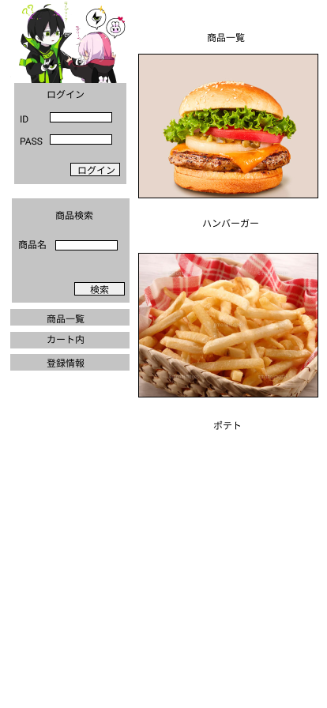

### 画面詳細図
## トップページ
### プロトタイプは以下のリンク先
[プロトタイプ](https://www.figma.com/file/p0bekIIHsUikuloZxUNZ6q/Untitled?node-id=1%3A2)
*****

*****
補足：対応DBの列はDB設計後、〇を対応するテーブル・カラム名に差し替えること。

| ID | 要素 | 内容 | アクション | イベント | 対応DB |
|----|-----|------|------------|-----------|-------|
|1   |バナー|サイト名表示|-    |-           |-     |
|2   |ログイン|テキスト画像|-   |-          |-       |
|3   |ID|入力欄|テキスト入力|-  |〇|
|4   |PASS|入力欄|テキスト入力|-  |〇|
|5   |ログインボタン|ボタン|クリック|ログイン処理実行|-          |
|6   |商品検索|テキスト画像|-    |-  |-          |
|7   |商品名|テキスト表示|-  |-  |-          |
|8   |商品名|入力欄|テキスト入力|-  |-          |
|9   |検索|ボタン|クリック|検索処理実行|〇|
|10   |商品一覧|画面ボタン|クリック|商品一覧へ遷移|〇|
|11   |カート内|画面ボタン|クリック|カート内へ遷移|〇|
|12   |登録情報|画面ボタン|クリック|登録情報へ遷移|〇|
|13   |商品一覧|テキスト表示|-     |-      |〇|
|14   |商品画像|画像リンク|クリック|商品詳細へ遷移|〇|
|15   |商品名|テキストリンク|クリック|商品詳細へ遷移|〇|
|16   |価格|テキスト表示|-   |-     |〇|
